# A curated list of Skype emoticons

<a title='(bhangra)' href='./emotes/bhangra.gif'>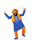</a>

<a title='(bike)' href='./emotes/bike.gif'>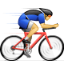</a>

<a title='(bomb)' href='./emotes/bomb.gif'>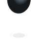</a>

<a title='(bowled)' href='./emotes/bowled.gif'>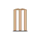</a>

<a title='(bug)' href='./emotes/bug.gif'>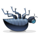</a>

<a title='(car)' href='./emotes/car.gif'>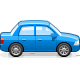</a>

<a title='(cat)' href='./emotes/cat.gif'>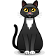</a>
<a title='(celebrate)' href='./emotes/celebrate.gif'>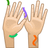</a>
<a title='(chai)' href='./emotes/chai.gif'>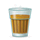</a>

<a title='(dhakkan)' href='./emotes/dhakkan.gif'>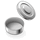</a>

<a title='(donkey)' href='./emotes/donkey.gif'>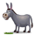</a>

<a title='(fear)' href='./emotes/fear.gif'>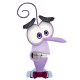</a>

<a title='(football)' href='./emotes/football.gif'>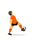</a>

<a title='(ghost)' href='./emotes/ghost.gif'>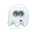</a>

<a title='(gottarun)' href='./emotes/gottarun.gif'>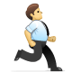</a>

<a title='(heidy)' href='./emotes/heidy.gif'>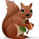</a>

<a title='(holdon)' href='./emotes/holdon.gif'>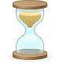</a>

<a title='(hug)' href='./emotes/hug.gif'>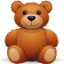</a>

<a title='(laddu)' href='./emotes/laddu.gif'>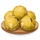</a>

<a title='(muscle)' href='./emotes/muscle.gif'>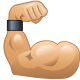</a>

<a title='(pizza)' href='./emotes/pizza.gif'>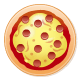</a>

<a title='(polarbear)' href='./emotes/polarbear.gif'>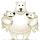</a>
<a title='(poolparty)' href='./emotes/poolparty.gif'>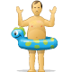</a>

<a title='(punch)' href='./emotes/punch.gif'>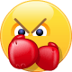</a>
<a title='(rain)' href='./emotes/rain.gif'>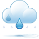</a>
<a title='(rainbow)' href='./emotes/rainbow.gif'>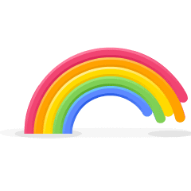</a>
<a title='(reindeer)' href='./emotes/reindeer.gif'>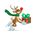</a>

<a title='(sheep)' href='./emotes/sheep.gif'>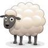</a>

<a title='(shot)' href='./emotes/shot.gif'>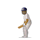</a>

<a title='(slap)' href='./emotes/slap.gif'>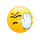</a>

<a title='(snail)' href='./emotes/snail.gif'>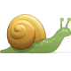</a>

<a title='(suryannamaskar)' href='./emotes/suryannamaskar.gif'>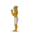</a>
<a title='(swear)' href='./emotes/swear.gif'>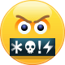</a>

<a title='(tandoori)' href='./emotes/tandoori.gif'>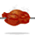</a>

<a title='(tubelight)' href='./emotes/tubelight.gif'>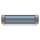</a>

<a title='(turkey)' href='./emotes/turkey.gif'>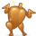</a>

<a title='(victory)' href='./emotes/victory.gif'>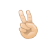</a>

<a title='(zombie)' href='./emotes/zombie.gif'>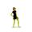</a>

###### Disclaimer: Skype emoticons are trade marks of Skype and Benzi is not affiliated, sponsored, authorised or otherwise associated by/with the Skype group of companies.