# A curated list of Skype emoticons

<a title="(acorn)" href="./emotes/anim/white/acorn.gif">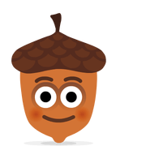</a>

<a title="(aokijump)" href="./emotes/anim/white/aokijump.gif">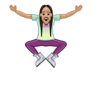</a>
<a title="(auld)" href="./emotes/anim/white/auld.gif">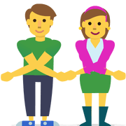</a>
<a title="(avocadolove)" href="./emotes/anim/white/avocadolove.gif">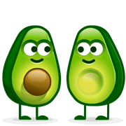</a>
<a title="(baku2017)" href="./emotes/anim/white/baku2017.gif">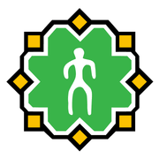</a>

<a title="(bartlett)" href="./emotes/anim/white/bartlett.gif">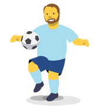</a>
<a title="(batcry)" href="./emotes/anim/white/batcry.gif">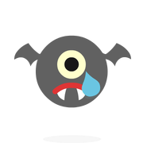</a>
<a title="(batsmile)" href="./emotes/anim/white/batsmile.gif">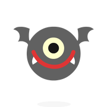</a>
<a title="(bb8)" href="./emotes/anim/white/bb8.gif">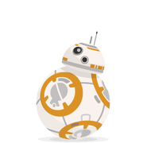</a>
<a title="(bb9e)" href="./emotes/anim/white/bb9e.gif">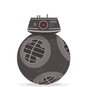</a>

<a title="(breakfastinbed)" href="./emotes/anim/white/breakfastinbed.gif">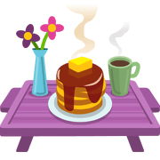</a>

<a title="(bunny)" href="./emotes/anim/white/bunny.gif">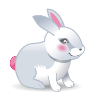</a>
<a title="(bunnyhug)" href="./emotes/anim/white/bunnyhug.gif">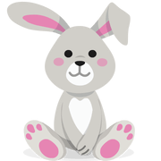</a>
<a title="(busyday)" href="./emotes/anim/white/busyday.gif">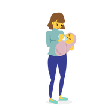</a>
<a title="(cactuslove)" href="./emotes/anim/white/cactuslove.gif">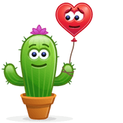</a>

<a title="(cakethrow)" href="./emotes/anim/white/cakethrow.gif">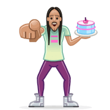</a>

<a title="(chewbacca)" href="./emotes/anim/white/chewbacca.gif">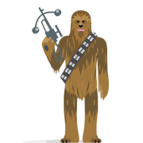</a>
<a title="(chicksegg)" href="./emotes/anim/white/chicksegg.gif">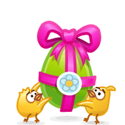</a>

<a title="(coutinho10)" href="./emotes/anim/white/coutinho10.gif">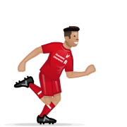</a>

<a title="(cupcake)" href="./emotes/anim/white/cupcake.gif">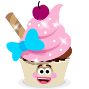</a>

<a title="(dadtime)" href="./emotes/anim/white/dadtime.gif">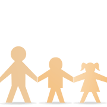</a>

<a title="(dedmoroz)" href="./emotes/anim/white/dedmoroz.gif">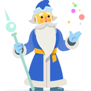</a>

<a title="(dotdmale)" href="./emotes/anim/white/dotdmale.gif">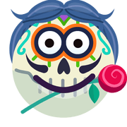</a>
<a title="(dracula)" href="./emotes/anim/white/dracula.gif">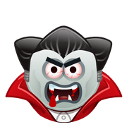</a>

<a title="(dreidel)" href="./emotes/anim/white/dreidel.gif">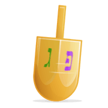</a>

<a title="(dropthemic)" href="./emotes/anim/white/dropthemic.gif">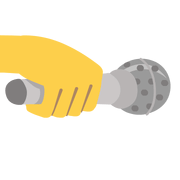</a>

<a title="(fallinlove)" href="./emotes/anim/white/fallinlove.gif">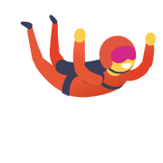</a>

<a title="(familytime)" href="./emotes/anim/white/familytime.gif">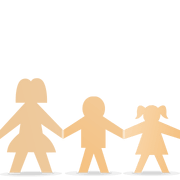</a>

<a title="(foxhug)" href="./emotes/anim/white/foxhug.gif">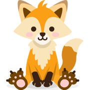</a>
<a title="(frankenstein)" href="./emotes/anim/white/frankenstein.gif">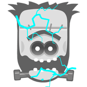</a>

<a title="(ganesh)" href="./emotes/anim/white/ganesh.gif">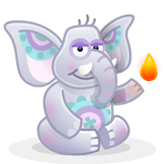</a>

<a title="(gingerkeepfit)" href="./emotes/anim/white/gingerkeepfit.gif">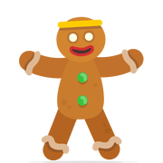</a>
<a title="(glassceiling)" href="./emotes/anim/white/glassceiling.gif">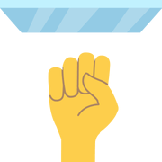</a>

<a title="(grannyscooter)" href="./emotes/anim/white/grannyscooter.gif">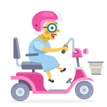</a>
<a title="(greatpear)" href="./emotes/anim/white/greatpear.gif">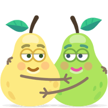</a>

<a title="(hedgehog)" href="./emotes/anim/white/hedgehog.gif">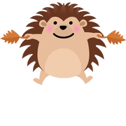</a>
<a title="(hedgehoghug)" href="./emotes/anim/white/hedgehoghug.gif">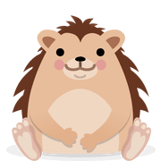</a>

<a title="(hendance)" href="./emotes/anim/white/hendance.gif">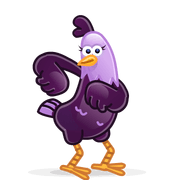</a>
<a title="(henderson14)" href="./emotes/anim/white/henderson14.gif">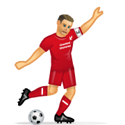</a>

<a title="(hotchocolate)" href="./emotes/anim/white/hotchocolate.gif">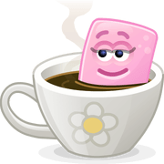</a>

<a title="(hungrycat)" href="./emotes/anim/white/hungrycat.gif">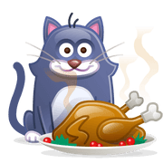</a>

<a title="(jekyllandhyde)" href="./emotes/anim/white/jekyllandhyde.gif">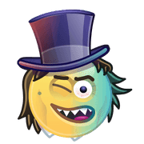</a>

<a title="(karlmordo)" href="./emotes/anim/white/karlmordo.gif">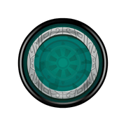</a>

<a title="(kolony)" href="./emotes/anim/white/kolony.gif">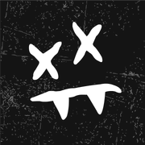</a>

<a title="(kyloren)" href="./emotes/anim/white/kyloren.gif">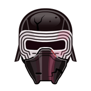</a>

<a title="(lamb)" href="./emotes/anim/white/lamb.gif">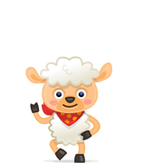</a>
<a title="(lang)" href="./emotes/anim/white/lang.gif">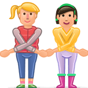</a>

<a title="(lfcclap)" href="./emotes/anim/white/lfcclap.gif">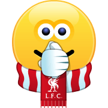</a>
<a title="(lfcfacepalm)" href="./emotes/anim/white/lfcfacepalm.gif">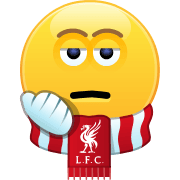</a>
<a title="(lfclaugh)" href="./emotes/anim/white/lfclaugh.gif">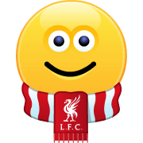</a>

###### Disclaimer: Skype emoticons are trade marks of Skype and Benzi is not affiliated, sponsored, authorised or otherwise associated by/with the Skype group of companies.
