# A curated list of Skype emoticons

<a title='(abe)' href='./emotes/anim/trans/abe.gif'>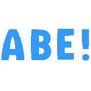</a>

<a title='(anger)' href='./emotes/anim/trans/anger.gif'>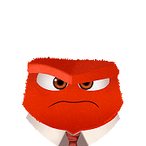</a>

<a title='(bandit)' href='./emotes/anim/trans/bandit.gif'>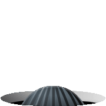</a>

<a title='(bertlett)' href='./emotes/anim/trans/bertlett.gif'>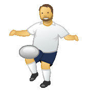</a>
<a title='(bhangra)' href='./emotes/anim/trans/bhangra.gif'>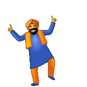</a>
<a title='(bike)' href='./emotes/anim/trans/bike.gif'>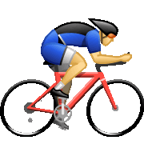</a>

<a title='(bowled)' href='./emotes/anim/trans/bowled.gif'>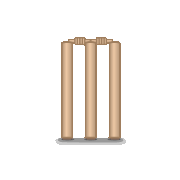</a>

<a title='(bug)' href='./emotes/anim/trans/bug.gif'>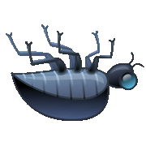</a>

<a title='(car)' href='./emotes/anim/trans/car.gif'>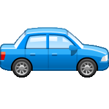</a>

<a title='(cat)' href='./emotes/anim/trans/cat.gif'>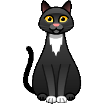</a>
<a title='(chai)' href='./emotes/anim/trans/chai.gif'>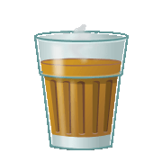</a>

<a title='(cheese)' href='./emotes/anim/trans/cheese.gif'>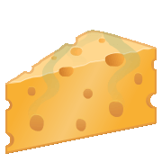</a>

<a title='(coffee)' href='./emotes/anim/trans/coffee.gif'>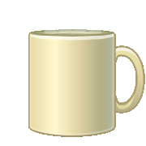</a>

<a title='(dhakkan)' href='./emotes/anim/trans/dhakkan.gif'>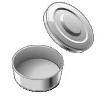</a>
<a title='(discodancer)' href='./emotes/anim/trans/discodancer.gif'>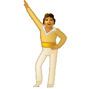</a>

<a title='(donkey)' href='./emotes/anim/trans/donkey.gif'>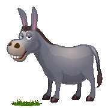</a>

<a title='(fear)' href='./emotes/anim/trans/fear.gif'>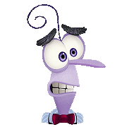</a>

<a title='(footballfail)' href='./emotes/anim/trans/footballfail.gif'>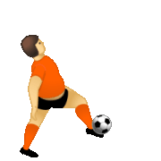</a>

<a title='(gottarun)' href='./emotes/anim/trans/gottarun.gif'>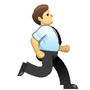</a>

<a title='(handsinair)' href='./emotes/anim/trans/handsinair.gif'>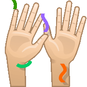</a>

<a title='(heidy)' href='./emotes/anim/trans/heidy.gif'>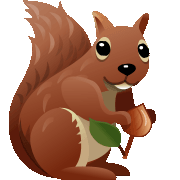</a>

<a title='(holdon)' href='./emotes/anim/trans/holdon.gif'>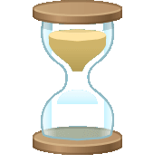</a>

<a title='(hug)' href='./emotes/anim/trans/hug.gif'>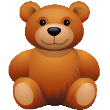</a>

<a title='(joy)' href='./emotes/anim/trans/joy.gif'>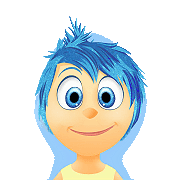</a>

<a title='(laddu)' href='./emotes/anim/trans/laddu.gif'>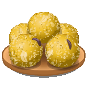</a>
<a title='(ladyvampire)' href='./emotes/anim/trans/ladyvampire.gif'>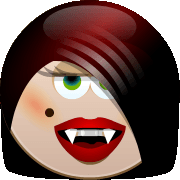</a>

<a title='(monkey)' href='./emotes/anim/trans/monkey.gif'>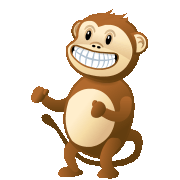</a>
<a title='(mooning)' href='./emotes/anim/trans/mooning.gif'>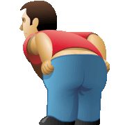</a>

<a title='(muscle)' href='./emotes/anim/trans/muscle.gif'>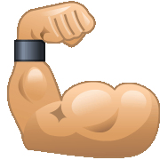</a>
<a title='(muscleman)' href='./emotes/anim/trans/muscleman.gif'>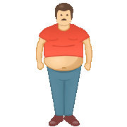</a>

<a title='(naturescall)' href='./emotes/anim/trans/naturescall.gif'>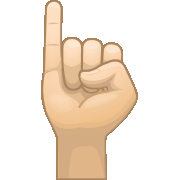</a>

<a title='(ontheloo)' href='./emotes/anim/trans/ontheloo.gif'>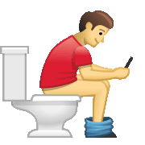</a>
<a title='(oye)' href='./emotes/anim/trans/oye.gif'>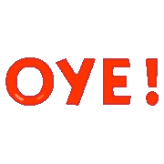</a>

<a title='(polarbear)' href='./emotes/anim/trans/polarbear.gif'>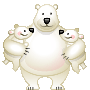</a>
<a title='(poolparty)' href='./emotes/anim/trans/poolparty.gif'>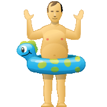</a>

<a title='(priidu)' href='./emotes/anim/trans/priidu.gif'>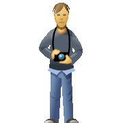</a>

<a title='(pullshot)' href='./emotes/anim/trans/pullshot.gif'>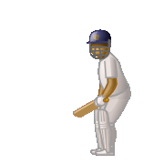</a>

<a title='(punch)' href='./emotes/anim/trans/punch.gif'>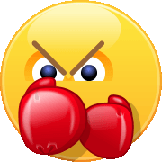</a>
<a title='(rain)' href='./emotes/anim/trans/rain.gif'>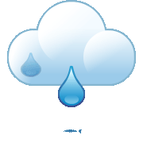</a>

<a title='(reindeer)' href='./emotes/anim/trans/reindeer.gif'>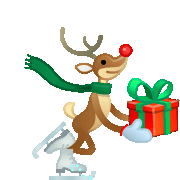</a>
<a title='(rickshaw)' href='./emotes/anim/trans/rickshaw.gif'>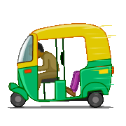</a>

<a title='(santamooning)' href='./emotes/anim/trans/santamooning.gif'>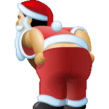</a>

<a title='(sheep)' href='./emotes/anim/trans/sheep.gif'>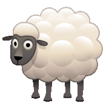</a>

<a title='(skipping)' href='./emotes/anim/trans/skipping.gif'>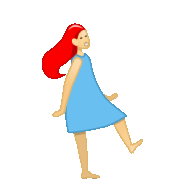</a>

<a title='(snail)' href='./emotes/anim/trans/snail.gif'>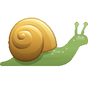</a>
<a title='(snowangel)' href='./emotes/anim/trans/snowangel.gif'>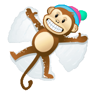</a>

<a title='(suryannamaskar)' href='./emotes/anim/trans/suryannamaskar.gif'>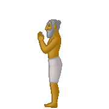</a>

<a title='(tandoorichicken)' href='./emotes/anim/trans/tandoorichicken.gif'>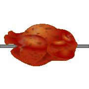</a>

<a title='(time)' href='./emotes/anim/trans/time.gif'>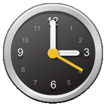</a>

<a title='(toivo)' href='./emotes/anim/trans/toivo.gif'>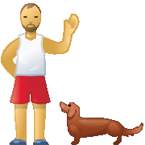</a>

###### Disclaimer: Skype emoticons are trade marks of Skype and Benzi is not affiliated, sponsored, authorised or otherwise associated by/with the Skype group of companies.