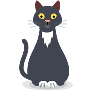
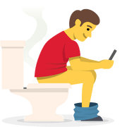
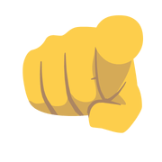
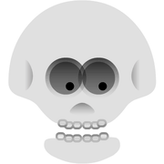
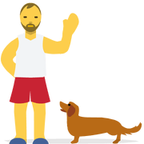
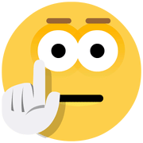
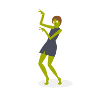

# A curated list of Skype emoticons

###### Disclaimer: Skype emoticons are trade marks of Skype and Benzi is not affiliated, sponsored, authorised or otherwise associated by/with the Skype group of companies.