# A curated list of Skype emoticons

<a title="(ancientone)" href="./emotes/anim/white/ancientone.gif">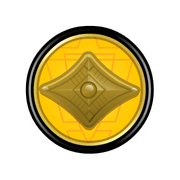</a>

<a title="(bhangra)" href="./emotes/anim/white/bhangra.gif">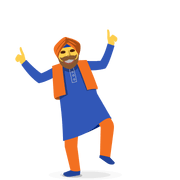</a>
<a title="(bike)" href="./emotes/anim/white/bike.gif">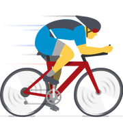</a>

<a title="(bomb)" href="./emotes/anim/white/bomb.gif">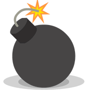</a>
<a title="(bow)" href="./emotes/anim/white/bow.gif">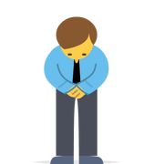</a>

<a title="(bunny)" href="./emotes/anim/white/bunny.gif">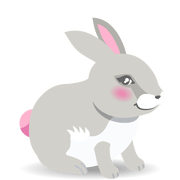</a>

<a title="(chappal)" href="./emotes/anim/white/chappal.gif">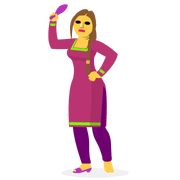</a>

<a title="(dance)" href="./emotes/anim/white/dance.gif">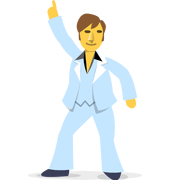</a>

<a title="(gran)" href="./emotes/anim/white/gran.gif">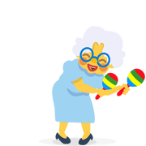</a>

<a title="(hero)" href="./emotes/anim/white/hero.gif">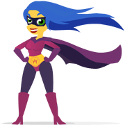</a>

<a title="(highfive)" href="./emotes/anim/white/highfive.gif">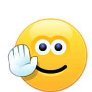</a>

<a title="(klopp)" href="./emotes/anim/white/klopp.gif">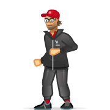</a>

<a title="(nahi)" href="./emotes/anim/white/nahi.gif">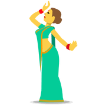</a>

<a title="(ninja)" href="./emotes/anim/white/ninja.gif">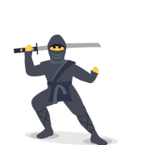</a>

<a title="(penguin)" href="./emotes/anim/white/penguin.gif">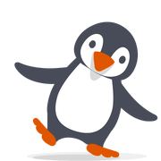</a>

<a title="(shock)" href="./emotes/anim/white/shock.gif">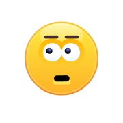</a>

<a title="(slamdunk)" href="./emotes/anim/white/slamdunk.gif">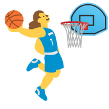</a>

<a title="(stop)" href="./emotes/anim/white/stop.gif">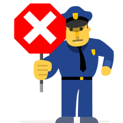</a>

<a title="(swear)" href="./emotes/anim/white/swear.gif">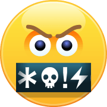</a>

<a title="(synchswim)" href="./emotes/anim/white/synchswim.gif">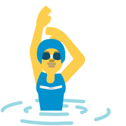</a>

<a title="(tmi)" href="./emotes/anim/white/tmi.gif">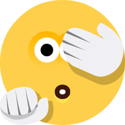</a>

<a title="(trampoline)" href="./emotes/anim/white/trampoline.gif">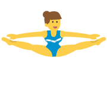</a>

<a title="(victory)" href="./emotes/anim/white/victory.gif">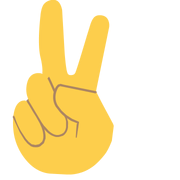</a>

###### Disclaimer: Skype emoticons are trade marks of Skype and Benzi is not affiliated, sponsored, authorised or otherwise associated by/with the Skype group of companies.
